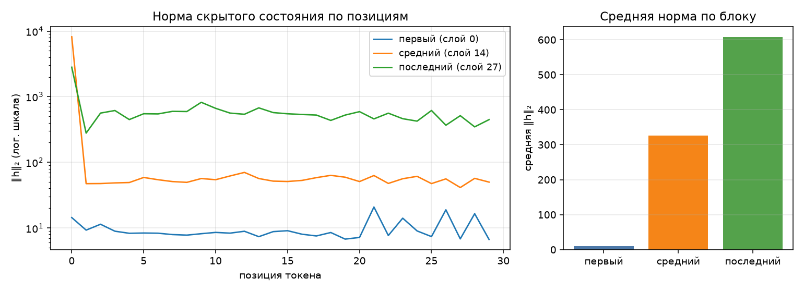

# Анатомия Qwen3-0.6B

Сгенерировано `make inspect`. dtype `bfloat16`, device `cuda`.

## 1. Конфигурация

| Параметр | Значение |
|---|--:|
| слоёв | 28 |
| hidden_size | 1024 |
| intermediate_size | 3072 |
| голов запроса | 16 |
| KV-голов (GQA) | 8 |
| head_dim | 128 |
| словарь | 151 936 |
| tie_word_embeddings | True |

GQA: 16 голов запроса на 8 KV-головы — KV-cache вдвое меньше, чем при обычном multi-head.

## 2. Условия замера

| Условие | Значение |
|---|---|
| платформа | Linux-6.18.33.2-microsoft-standard-WSL2-x86_64-with-glibc2.39 (Linux 6.18.33.2-microsoft-standard-WSL2, x86_64) |
| устройство | `cuda` |
| dtype | `bfloat16` |
| seq_len × batch | 256 × 1 |
| прогонов на режим | 1 |
| память измерена | `torch.cuda.max_memory_allocated` |
| RSS измерена | `ru_maxrss` |
| python | 3.12.14 |
| torch | 2.14.0+cu130 |
| transformers | 5.17.0 |
| peft | 0.20.0 |

## 3. Параметры по типам модулей

| Группа | Модулей | Shape | Параметров | Доля | Разделяет тензор |
|---|--:|---|--:|--:|--:|
| `embed` | 1 | 151936×1024 | 155 582 464 | 26.10% | — |
| `q_proj` | 28 | 2048×1024 | 58 720 256 | 9.85% | — |
| `k_proj` | 28 | 1024×1024 | 29 360 128 | 4.93% | — |
| `v_proj` | 28 | 1024×1024 | 29 360 128 | 4.93% | — |
| `o_proj` | 28 | 1024×2048 | 58 720 256 | 9.85% | — |
| `gate_proj` | 28 | 3072×1024 | 88 080 384 | 14.78% | — |
| `up_proj` | 28 | 3072×1024 | 88 080 384 | 14.78% | — |
| `down_proj` | 28 | 1024×3072 | 88 080 384 | 14.78% | — |
| `norm` | 113 | 128, 1024 | 65 536 | 0.01% | — |
| `lm_head` | 1 | 151936×1024 | 0 | 0.00% | 155 582 464 |
| **итого** | | | **596 049 920** | 100% | |

Контроль: `sum(p.numel() for p in model.parameters())` = 596 049 920 — сходится с суммой по таблице.

Обратите внимание на строку `lm_head` и на значение `tie_word_embeddings`
в конфигурации: они связаны, и от этой связи зависит итог таблицы.

## 4. Нормы активаций (forward-hooks)

Промпт: «Объясни, что такое MLOps, в трёх предложениях.», 30 токенов после chat template.

| Блок | Индекс | Средняя ‖h‖₂ | Максимум |
|---|--:|--:|--:|
| первый | 0 | 9.7 | 20.9 |
| средний | 14 | 325.5 | 8189.7 |
| последний | 27 | 607.2 | 2815.1 |

Норма меняется по глубине сети из-за последовательных attention/MLP-блоков
и residual-связей. График дан в логарифмической шкале, чтобы крупные пики
не скрывали различия между остальными позициями токенов.

Во время прогона было зарегистрировано 3 хука; после `finally` на модели осталось 0.
Повторный вызов поэтому не накапливает новый комплект обработчиков.

## 5. Сколько параметров добавляет LoRA

| Конфиг | Целевых модулей | Своя формула | peft | Совпало | % от базовой |
|---|--:|--:|--:|:-:|--:|
| r=8, q_proj+v_proj | 2 типов | 1 146 880 | 1 146 880 | да | 0.192% |
| r=16, все линейные | 7 типов | 10 092 544 | 10 092 544 | да | 1.693% |

Формула: `r * (in_features + out_features)` на каждый целевой `Linear` —
`A` формы `(r, in)`, `B` формы `(out, r)`, смещений нет. Расхождение с
`print_trainable_parameters()` означает ошибку в списке целевых модулей,
а не «разные способы считать».

Доля в таблице считается от базовой модели. `peft` печатает свою долю от
модели ВМЕСТЕ с адаптером, поэтому его процент чуть меньше — числитель
у обоих один и тот же.

## 6. Память в трёх режимах

Один шаг на seq_len=256, batch=1, device=cuda. Метрика — аллокатор cuda (`torch.cuda.max_memory_allocated`), пик за прогон; колонка «Пик RSS» снята через `ru_maxrss`.
Вход — случайные id токенов: меряется память, а не качество, и loss здесь
смысловой нагрузки не несёт. Время — только измеряемый шаг: для inference
forward, для full FT/LoRA — forward + backward + optimizer.step(); загрузка
модели и подготовка optimizer в таймер не входят. На CUDA/MPS таймер
обрамлён synchronize(), чтобы учитывать фактическое выполнение на GPU.
У full FT и LoRA loss на первом шаге одинаковый, потому что
`B` в адаптере инициализирован нулями и до первого шага ничего не меняет).
Числа должны отличаться: по лекции full fine-tune стоит кратно дороже
инференса, а LoRA лежит между ними.

| Режим | Пик, МБ | Пик RSS, МБ | × к инференсу | Секунд | loss |
|---|--:|--:|--:|--:|--:|
| инференс | 1248 | 2333 | 1.00 | 1.398 | — |
| full fine-tune | 5805 | 2334 | 4.65 | 1.950 | 13.7072 |
| LoRA (r=8, q/v) | 2077 | 2334 | 1.66 | 1.810 | 13.7072 |

Прикидка из лекции: веса bf16 — 1137 МБ. При полном обучении к
весам добавляются градиенты (порядка +1137 МБ) и два состояния
AdamW (порядка +2274 МБ), плюс активации. Реальный пик зависит
от реализации оптимизатора и аллокатора, поэтому сравниваем с измерением,
а не подменяем его теоретической оценкой.
На этой машине full fine-tune = 4.65× к инференсу, LoRA = 1.66×; full fine-tune потребовал в 2.80× больше
пиковой памяти, чем LoRA.
LoRA обучает 1 146 880 параметров вместо 596 049 920: градиенты и состояния оптимизатора нужны
только адаптерам, но активации для backward всё равно сохраняются, поэтому
LoRA должна быть дороже чистого инференса.

RSS процесса по трём режимам имеет разброс 0 МБ, но основной
пик снят через `torch.cuda.max_memory_allocated`. На `cuda` тензоры
лежат в памяти ускорителя, поэтому RSS процесса используется только как
дополнительная диагностическая колонка и не выдаётся за память модели.

## 7. Четыре найденных дефекта

### 7.1. Tied embeddings считались дважды

Исходный обход использовал `named_parameters(remove_duplicate=False)`, но
каждую строку помечал как уникальную. Поэтому общий тензор embeddings /
`lm_head` попадал в сумму дважды. Исправление: хранить `id(parameter)` в
`seen` и повторную ссылку отмечать как `tied`, не добавляя её в `params`.
Для этого прогона наивная сумма была бы 751 632 384, из них
повторно посчитано 155 582 464; корректная сумма —
596 049 920, ровно как прямой `sum(p.numel())` =
596 049 920.

### 7.2. Forward-hooks оставались жить после прогона

`register_forward_hook()` возвращает handle, который раньше терялся. После
повторного запуска на модулях копились обработчики. Исправление: сохранять
handles и снимать каждый через `handle.remove()` в `finally`, чтобы очистка
сработала даже при исключении во время forward.
В текущем прогоне зарегистрировано 3 хуков,
после завершения осталось 0.

### 7.3. Вместо пика измерялся остаток памяти в конце

Старый `PeakMemory.__exit__()` сначала запускал `gc.collect()`, а затем снимал
одно текущее значение. Это отвечало на вопрос «что осталось после прогона»,
а не «какой был максимальный расход». Исправление: CUDA использует встроенный
high-water mark `torch.cuda.max_memory_allocated()`, MPS опрашивает
`torch.mps.driver_allocated_memory()` во время прогона, CPU использует системный
high-water mark RSS. Пик фиксируется до очистки объектов.
Полученные пики: inference 1248.2 МБ, LoRA 2076.8 МБ,
full fine-tune 5805.1 МБ.

### 7.4. На ускорителе использовался RSS процесса

Функция `device_allocated_bytes()` раньше фактически возвращала `ru_maxrss` /
`peak_wset` для любого устройства. На CUDA/MPS это не память ускорителя, поэтому
цифры почти не реагировали на реальные GPU-аллокации. Исправление: выбирать
метрику по устройству и запускать каждый режим в отдельном процессе через
служебный `--probe`, чтобы high-water mark одного режима не загрязнял следующий.
Основная метрика этого прогона — `torch.cuda.max_memory_allocated` на `cuda`;
для сравнения RSS инференса = 2333.2 МБ, а основной пик =
1248.2 МБ.
